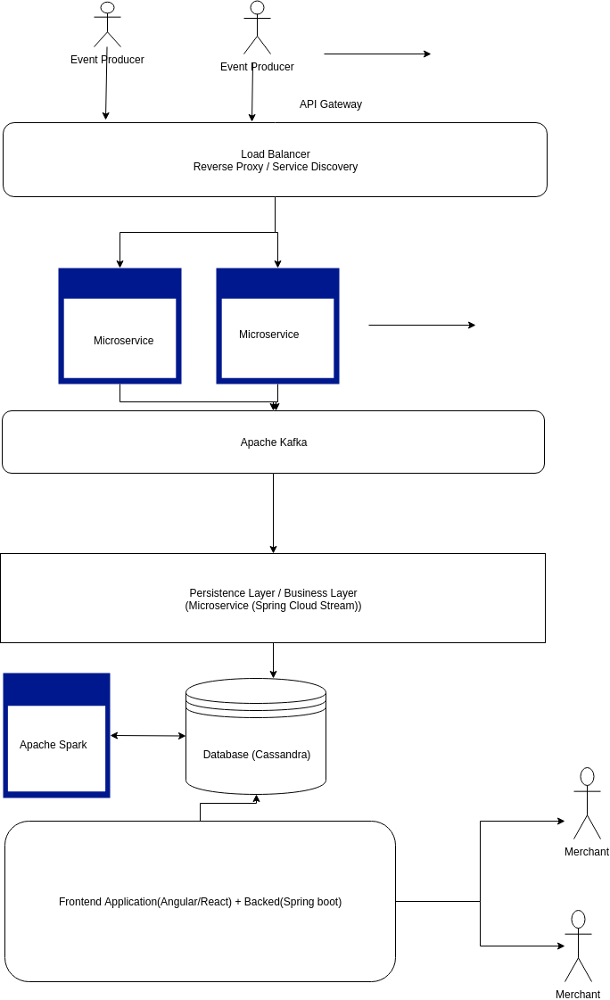

# PaytmLabs SDE Challenge

## Design Question

Design A Google Analytic like Backend System.
We need to provide Google Analytic like services to our customers. Please provide a high level solution design for the backend system. Feel free to choose any open source tools as you want.

### Main application tech stack:

- Apache Kafka
- Apache Spark
- Apache Cassandra
- Spring Boot + Spring Cloud Stream
- Angular/Reach

Note:- The above list does not contains infrastructure applcations, reverse proxy, etc

### Properties

- Easily Scalable
- Fault tolerant
- High availability
- Modular
- Heavy use of open-source components

### Assumptions
- Authentication of users is already taken care of.
- All the events are considered to be timeseries events.
- Events producer will push these events to the system by calling the HTTP REST Api

### Components

- API Gateway - It is layer which handles all HTTP traffic to the application.
- Web microservices(Spring Boot) - Stateless application responsible for authentication and writing the events to the Kafka topics
- Apache Kafka - Data bus which can be served as buffer between web services and persistence layer to handle large traffic
- Persistence/Business layer(Spring Cloud Stream) - Used to process the raw event from Kafka topic and store it in database
- Apache Spark - Used for data analytics on the process events
- Database(Cassandra) - Used to store the event . It's also highly avaialbe and lineraly scalable. It can handle millions of write per day
- Frontend Application(Angular/React) - Used for client view where they can view the metric based on events
- Backend Application(Spring boot) - Used to provide the REST endpoint for the frontend application

### Requirements

1. Handle large write volume: Billions of write events per day.

- Kafka and Cassandra are used for ingesting the data. These tools are proven to handle billions of write events per day

2. Handle large read/query volume: Millions of merchants wish to gain insight into their business. Read/Query patterns are time-series related metrics.

- Apache Spark can be used to do analysis on the data.
- Angular/React can be for Frontend application for Merchant view.
- Spring boot can be used for Serving API layer for frontend application.

3. Provide metrics to customers with at most one hour delay.

- Apache Spark is the big data analytics engine which is 100X faster than Hadoop.

4. Run with minimum downtime.

- All the tools used are lineraly scalable and fault tolerant.

5. Have the ability to reprocess historical data in case of bugs in the processing logic.

- Data should be store based on time series along with client identifier
- By storing the data in time series format, we can have the ability to re-process the data and it will override the previous data
- Spark jobs can be configure to trigger based on some event which can re-calculate the metrics

#### Extra: -
- Flow diagram has been created using https://www.draw.io/.
- Diagram can be imported using [PaytmDesignExercise.xml](./PaytmDesignExercise.xml)